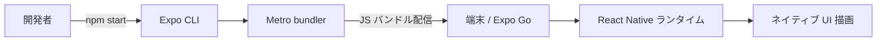

# 02 Project Structure

## ゴール

- 主要ファイルの役割を定義して説明できる
- Expo と React Native と Metro の関係を図で説明できる
- どのファイル変更がどの挙動に影響するか言える

## 手順

前章で起動できた状態を前提に、構成を理解する。

用語定義:
- React Native: JavaScript でネイティブ UI を描画するランタイムとライブラリ群。
- Expo: RN をすぐ動かせる状態にする開発プラットフォーム。CLI と dev server を含む。
- Metro bundler: RN 用の開発バンドラ。JS を束ねて端末へ配信する。
- app.json: アプリのメタ情報。アイコンやスプラッシュ、表示名を保持する。

1. ルート直下の主要ファイルを確認する

```txt
App.tsx           # UI の入口
app.json          # アプリのメタ情報（名前・アイコン等）
package.json      # 依存関係と scripts
package-lock.json # 依存の固定
assets/           # 画像などの静的リソース
```

2. 起動フローを把握する



3. `App.tsx` を編集して UI が変わる理由を確認する

`App.tsx` は UI ツリーの起点なので、ここを変えると端末表示が変わる。

```tsx
import { View, Text } from "react-native";

export default function App() {
  return (
    <View style={{ padding: 24 }}>
      <Text>Project Structure Check</Text>
    </View>
  );
}
```

4. `package.json` scripts を読む

`npm start` は `expo start` を実行するショートカット。

```json
{
  "scripts": {
    "start": "expo start",
    "android": "expo start --android",
    "ios": "expo start --ios",
    "web": "expo start --web"
  }
}
```

## 詰まりポイント

- `App.tsx` を編集しても反映されない
- Metro が別プロジェクトのバンドルを配っている
- `npm start` と `npx expo start` の違いが分からない

## Webとの差分

- Web はブラウザが実行環境だが、RN は端末と RN ランタイムが実行環境
- Web は HTML/CSS を描画するが、RN はネイティブ UI を描画する

## 振り返り

- 主要ファイルの役割を説明できるか
- 変更が反映されるまでの流れを説明できるか
- 次は UI の最小構成を作る
