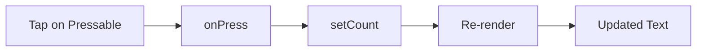

# 03 UI Basics

## ゴール

- `View` / `Text` / `Pressable` を使える
- `StyleSheet` と inline style の違いを説明できる
- 最小のカウンター UI を作れる

## 手順

前章で入口を理解したので、最小の UI を作る。

用語定義:
- View: レイアウト用の箱。Web の `div` に近い。
- Text: 文字を描画するコンポーネント。文字列は必ず Text に入れる。
- Pressable: 押下可能な領域。タップイベントを受け取る。
- StyleSheet: スタイルをまとめる RN のユーティリティ。

1. `App.tsx` を最小カウンターにする

```tsx
import { useState } from "react";
import { View, Text, Pressable, StyleSheet } from "react-native";

export default function App() {
  const [count, setCount] = useState(0);

  return (
    <View style={styles.container}>
      <Text style={styles.title}>Counter</Text>
      <Text style={styles.value}>{count}</Text>
      <Pressable style={styles.button} onPress={() => setCount(count + 1)}>
        <Text style={styles.buttonText}>+1</Text>
      </Pressable>
    </View>
  );
}

const styles = StyleSheet.create({
  container: { flex: 1, alignItems: "center", justifyContent: "center" },
  title: { fontSize: 20, marginBottom: 8 },
  value: { fontSize: 32, marginBottom: 12 },
  button: { paddingVertical: 8, paddingHorizontal: 16, backgroundColor: "#222" },
  buttonText: { color: "#fff" },
});
```

2. Pressable が state を更新し再描画される流れを確認する



3. StyleSheet と inline の使い分けを決める

- StyleSheet は再利用・読みやすさ向き
- inline は検証や一時的な調整向き

## 詰まりポイント

- Text 以外に文字列を置くとエラーになる
- Pressable の子に Text がないと文字が出ない
- スタイルの単位は数値で `px` は不要

## Webとの差分

- DOM は存在せず、RN のコンポーネントで UI を組む
- CSS ではなく JS でスタイルを書く

## 振り返り

- View と Text の使い分けを説明できるか
- Pressable と state 更新の関係を言語化できるか
- 次はレイアウトの基本を学ぶ
