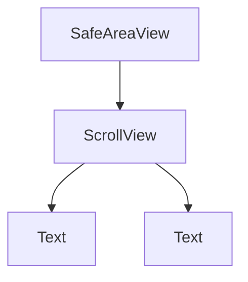

# 04 Layout

## ゴール

- RN の Flexbox ルールを理解する
- `SafeAreaView` と `ScrollView` を使える
- 画面サイズに配慮したレイアウトが作れる

## 手順

前章の UI を、レイアウトの観点で整理する。

用語定義:
- Flexbox: 要素の並びと伸縮を定義するレイアウト方式。RN では Yoga が実装。
- SafeAreaView: ノッチやステータスバーを避けるためのコンテナ。
- ScrollView: 内容が画面に収まらないときにスクロールさせる。

1. Flexbox のデフォルトを確認する

RN の `flexDirection` は `column` がデフォルト。

2. SafeAreaView を使う

```tsx
import { SafeAreaView, View, Text } from "react-native";

export default function App() {
  return (
    <SafeAreaView style={{ flex: 1 }}>
      <View style={{ padding: 16 }}>
        <Text>Safe Area</Text>
      </View>
    </SafeAreaView>
  );
}
```

3. ScrollView で縦に並べる

```tsx
import { SafeAreaView, ScrollView, Text } from "react-native";

export default function App() {
  return (
    <SafeAreaView style={{ flex: 1 }}>
      <ScrollView contentContainerStyle={{ padding: 16 }}>
        <Text>Item 1</Text>
        <Text>Item 2</Text>
        <Text>Item 3</Text>
      </ScrollView>
    </SafeAreaView>
  );
}
```

レイアウトの関係図:



## 詰まりポイント

- Web と逆で縦並びがデフォルト
- 画面下部に要素が隠れる
- ScrollView に `flex: 1` を付けても期待通りにならないことがある

## Webとの差分

- Web の Safe Area は CSS で扱うが、RN は SafeAreaView を使う
- Flexbox のデフォルト方向が異なる

## 振り返り

- SafeAreaView の必要性を説明できるか
- ScrollView と FlatList の違いを意識できたか
- 次は画面遷移を扱う
