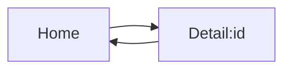

# 05 Navigation

## ゴール

- Expo Router を導入できる
- Stack / Tabs の役割を理解する
- パラメータ受け渡しの基礎を理解する

## 手順

前章で画面配置ができたので、画面遷移を導入する。

用語定義:
- Expo Router: Expo のファイルベースルーティング。
- Stack: 画面を積み上げて戻れる遷移モデル。
- Tabs: 並列カテゴリを切り替えるナビゲーション。

1. Expo Router を導入する

```bash
npx expo install expo-router
```

2. 最小のルーティング構成を作る

`app/_layout.tsx` を作成する。

```tsx
import { Stack } from "expo-router";

export default function Layout() {
  return <Stack />;
}
```

`app/index.tsx` を作成する。

```tsx
import { View, Text } from "react-native";

export default function Home() {
  return (
    <View style={{ padding: 24 }}>
      <Text>Home</Text>
    </View>
  );
}
```

3. パラメータ受け渡しの考え方を確認する

`app/detail/[id].tsx` のような動的ルートで URL パラメータを受け取る。

遷移の概念図:



## 詰まりポイント

- `app/` 配下の構成を間違えると画面が出ない
- ルート更新が反映されない場合は再起動が必要

## Webとの差分

- Web は URL を中心に遷移するが、RN はネイティブの画面遷移
- ブラウザ履歴と完全には一致しない

## 振り返り

- Stack と Tabs の使い分けを説明できるか
- 画面遷移設計を紙に書けるか
- 次は状態管理の基本に進む
