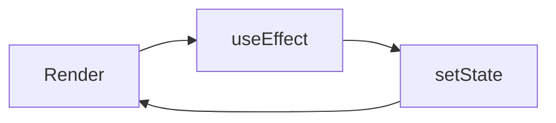

# 06 State Management

## ゴール

- `useState` / `useEffect` の基本を理解する
- フォーム入力を扱える
- 状態設計の考え方を説明できる

## 手順

前章で画面遷移を知ったので、画面内の状態を扱う。

用語定義:
- state: UI の見た目を決めるデータ。
- effect: 描画とは別の副作用処理。
- re-render: state が変わったときの再描画。

1. `useState` で入力値を持つ

```tsx
import { useState } from "react";
import { View, TextInput, Text } from "react-native";

export default function App() {
  const [name, setName] = useState("");

  return (
    <View style={{ padding: 16 }}>
      <TextInput
        value={name}
        onChangeText={setName}
        placeholder="Type your name"
      />
      <Text>Hello, {name}</Text>
    </View>
  );
}
```

2. `useEffect` の役割を理解する



3. 状態設計の粒度を決める

- 画面内だけで使う state は画面に置く
- 再利用する state はカスタムフックに切り出す

## 詰まりポイント

- state が増えると再レンダリング原因が分かりにくい
- 依存配列を忘れて effect が無限ループになる

## Webとの差分

- 基本概念は同じだが、入力コンポーネントが異なる
- TextInput はイベントではなく `onChangeText` で値を受け取る

## 振り返り

- state と effect の役割を説明できるか
- 再レンダリングの流れを言語化できるか
- 次はデータの永続化を扱う
