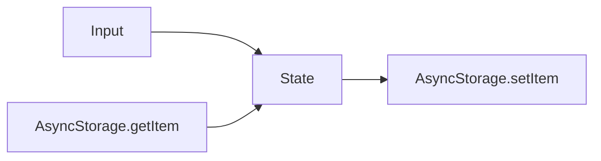

# 07 Data Persistence

## ゴール

- AsyncStorage の役割を理解する
- 永続化の設計を考えられる
- Web の `localStorage` との違いを説明できる

## 手順

前章の state を端末に保存できるようにする。

用語定義:
- AsyncStorage: RN のキー値ストレージ。非同期で読み書きする。
- serialization: JSON 文字列化と復元。

1. AsyncStorage を導入する

```bash
npx expo install @react-native-async-storage/async-storage
```

2. 保存と読み込みの最小実装を作る

```tsx
import { useEffect, useState } from "react";
import { View, TextInput } from "react-native";
import AsyncStorage from "@react-native-async-storage/async-storage";

const KEY = "profile:name";

export default function App() {
  const [name, setName] = useState("");

  useEffect(() => {
    AsyncStorage.getItem(KEY).then((v) => {
      if (v) setName(v);
    });
  }, []);

  useEffect(() => {
    AsyncStorage.setItem(KEY, name);
  }, [name]);

  return (
    <View style={{ padding: 16 }}>
      <TextInput value={name} onChangeText={setName} />
    </View>
  );
}
```

3. 永続化設計の指針を決める

- キーは `domain:feature:name` のように体系化する
- JSON で保存する場合は `JSON.stringify` / `JSON.parse` を使う

保存フロー:



## 詰まりポイント

- 文字列保存が前提なので JSON 変換を忘れやすい
- 初期表示が空のままになることがある

## Webとの差分

- API 形は似ているが非同期
- 保存場所は端末ごとで、ブラウザの devtools では確認できない

## 振り返り

- 永続化対象を説明できるか
- 保存と復元の流れを言語化できるか
- 次はネットワーク通信を扱う
