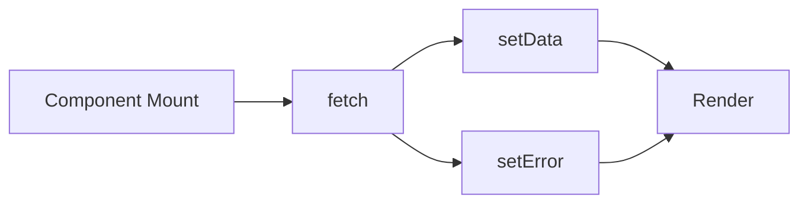

# 08 Networking

## ゴール

- `fetch` を使ってデータ取得できる
- API 設計の基本を理解する
- エラーハンドリングと loading 管理ができる

## 手順

前章の永続化に加え、外部データを取得する。

用語定義:
- loading state: データ取得中の状態。
- error state: 取得失敗時に UI を切り替える状態。

1. `fetch` の最小実装を作る

```tsx
import { useEffect, useState } from "react";
import { View, Text } from "react-native";

type User = { id: number; name: string };

export default function App() {
  const [data, setData] = useState<User | null>(null);
  const [loading, setLoading] = useState(true);
  const [error, setError] = useState<string | null>(null);

  useEffect(() => {
    fetch("https://jsonplaceholder.typicode.com/users/1")
      .then((res) => res.json())
      .then((json) => setData(json))
      .catch(() => setError("failed"))
      .finally(() => setLoading(false));
  }, []);

  if (loading) return <Text>Loading...</Text>;
  if (error) return <Text>Error</Text>;
  return (
    <View style={{ padding: 16 }}>
      <Text>{data?.name}</Text>
    </View>
  );
}
```

通信フロー:



2. API 設計の基本を確認する

- エンドポイント
- レスポンス形式
- 失敗時の形式

## 詰まりポイント

- ネットワークが切れると `fetch` が失敗する
- 実機とエミュレータで到達先が違う場合がある

## Webとの差分

- `fetch` 自体は同じだが、端末側のネットワーク制約がある
- CORS とは別の OS 制約が起きることがある

## 振り返り

- 成功時と失敗時の UI を分けられたか
- 次はデバイス機能を扱う
