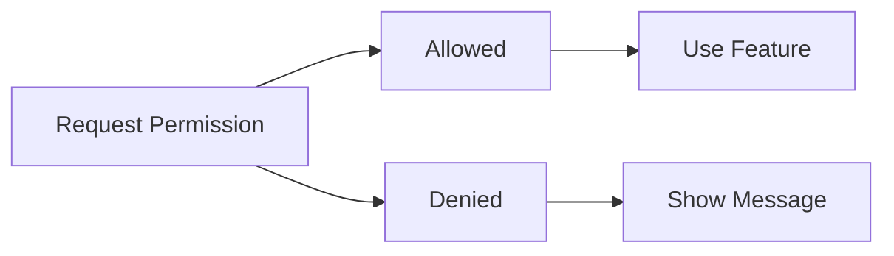

# 09 Device Features

## ゴール

- Camera / ImagePicker / Haptics の概要を理解する
- Permission 設計を考えられる
- Expo とネイティブの差分を理解する

## 手順

前章のネットワークに加え、端末固有機能を触る。

用語定義:
- Permission: OS 権限。ユーザーの許可がないと機能が使えない。
- ImagePicker: 画像選択 UI を呼び出す API。
- Haptics: 端末の触覚フィードバック。

1. モジュールを導入する

```bash
npx expo install expo-image-picker expo-haptics expo-camera
```

2. ImagePicker の最小実装を作る

```tsx
import { useState } from "react";
import { View, Text, Pressable } from "react-native";
import * as ImagePicker from "expo-image-picker";

export default function App() {
  const [uri, setUri] = useState<string | null>(null);

  const pick = async () => {
    const result = await ImagePicker.launchImageLibraryAsync({
      mediaTypes: ImagePicker.MediaTypeOptions.Images,
    });
    if (!result.canceled) setUri(result.assets[0].uri);
  };

  return (
    <View style={{ padding: 16 }}>
      <Pressable onPress={pick}>
        <Text>Pick Image</Text>
      </Pressable>
      <Text>{uri ?? "no image"}</Text>
    </View>
  );
}
```

権限フロー:



## 詰まりポイント

- 権限未許可だと機能が動かない
- シミュレータではカメラが使えない

## Webとの差分

- OS 権限が必要でユーザー許可が必須
- Expo で使える範囲が決まっている

## 振り返り

- 権限要求のタイミングを説明できるか
- 次はスタイリング戦略を扱う
