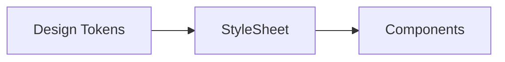

# 10 Styling Strategy

## ゴール

- StyleSheet の設計方針を理解する
- コンポーネント分割とスタイルの関係を説明できる
- テーマ設計とダークモードの基本を理解する

## 手順

前章の UI を保守しやすいスタイルに整理する。

用語定義:
- Theme: 色や余白などの共通値の集合。
- Design tokens: テーマを構成する定数群。

1. テーマ定数を作る

```ts
// constants/theme.ts
export const colors = {
  text: "#111",
  background: "#fff",
  primary: "#2563eb",
};
```

2. テーマを使ってスタイルを作る

```tsx
import { StyleSheet, View, Text } from "react-native";
import { colors } from "./constants/theme";

export default function App() {
  return (
    <View style={styles.container}>
      <Text style={styles.title}>Theme</Text>
    </View>
  );
}

const styles = StyleSheet.create({
  container: { flex: 1, backgroundColor: colors.background, padding: 16 },
  title: { color: colors.text, fontSize: 20 },
});
```

テーマ反映の関係図:



## 詰まりポイント

- スタイルが肥大化しやすい
- 画面ごとの責務が曖昧になる

## Webとの差分

- CSS 変数がないため、共通値は JS で持つ

## 振り返り

- スタイルの置き場を説明できるか
- 次はアーキテクチャ設計に進む
