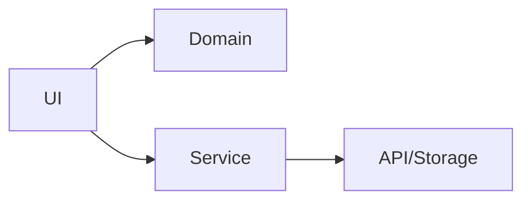

# 11 Architecture

## ゴール

- ディレクトリ設計の基本を理解する
- UI / Domain を分ける意義を説明できる
- 小規模アプリの構造を決められる

## 手順

前章の UI を整理し、構造を決める。

用語定義:
- UI 層: 表示と操作を担当する層。
- Domain 層: ルールや計算などの中心ロジック。
- Service 層: API やストレージなど外部アクセス。

1. 小規模構成を決める

```txt
components/
screens/
domain/
services/
```

2. Domain の関数を作る

```ts
// domain/calc.ts
export const double = (n: number) => n * 2;
```

3. UI から呼び出す

```tsx
import { View, Text } from "react-native";
import { double } from "./domain/calc";

export default function App() {
  return (
    <View style={{ padding: 16 }}>
      <Text>{double(21)}</Text>
    </View>
  );
}
```

依存関係図:



## 詰まりポイント

- 早期に分割しすぎて見通しが悪くなる
- 画面とロジックが混ざる

## Webとの差分

- 端末固有の処理が増える分、サービス層を分離したくなる

## 振り返り

- どの層に何を置くか説明できるか
- 次はパフォーマンスを扱う
