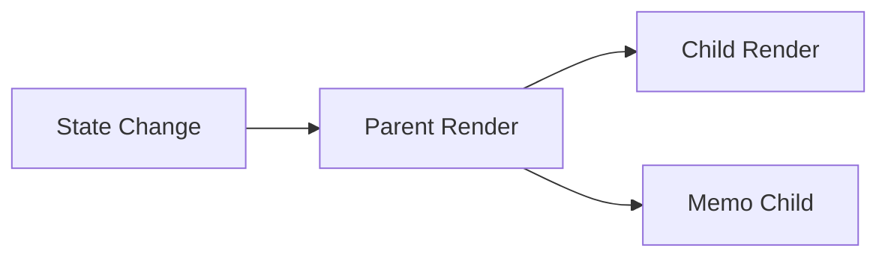

# 12 Performance

## ゴール

- 再レンダリング最適化の基本を理解する
- `memo` / `useCallback` を使える
- `FlatList` と画像最適化の考え方を理解する

## 手順

前章の構造を保ちつつ、パフォーマンスを意識する。

用語定義:
- memo: props が変わらない限り再描画を避ける仕組み。
- useCallback: 関数の再生成を抑えるフック。

1. `memo` と `useCallback` の最小例

```tsx
import { memo, useCallback, useState } from "react";
import { View, Text, Pressable } from "react-native";

const CountView = memo(function CountView({ value }: { value: number }) {
  return <Text>{value}</Text>;
});

export default function App() {
  const [count, setCount] = useState(0);
  const onPress = useCallback(() => setCount((c) => c + 1), []);

  return (
    <View style={{ padding: 16 }}>
      <CountView value={count} />
      <Pressable onPress={onPress}>
        <Text>+1</Text>
      </Pressable>
    </View>
  );
}
```

再レンダリングの伝播図:



2. 大量データは `FlatList` を使う

- `ScrollView` は全件を描画する
- `FlatList` は必要分だけ描画する

## 詰まりポイント

- 早期最適化で設計が複雑になる
- `memo` の効果が体感しにくい

## Webとの差分

- 端末性能差が大きいので体感差が出やすい

## 振り返り

- どこがボトルネックか説明できるか
- 次はテスト方針を整理する
