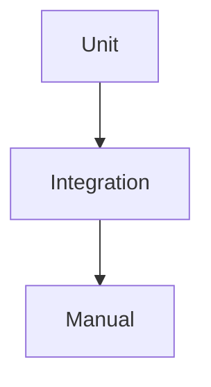

# 13 Testing

## ゴール

- テスト方針を整理できる
- ユニットテストの概念を理解する
- 実機確認の観点を持てる

## 手順

前章までの実装を検証する仕組みを整理する。

用語定義:
- unit test: 関数単位の検証。
- integration test: 複数要素を統合した検証。
- manual test: 実機での手動確認。

1. 純関数をテストする最小例

```ts
export const sum = (a: number, b: number) => a + b;
```

```ts
import { sum } from "./sum";

test("sum", () => {
  expect(sum(1, 2)).toBe(3);
});
```

テスト層の図:



2. 実機確認の観点を整理する

- 通信の成功と失敗
- 権限の許可と拒否
- 画面サイズの違い

## 詰まりポイント

- UI テストの環境構築が重い
- 実機でしか再現しない不具合がある

## Webとの差分

- 端末差異の確認が重要

## 振り返り

- 何を自動化し、何を手動で見るか決められるか
- 次はビルドを学ぶ
