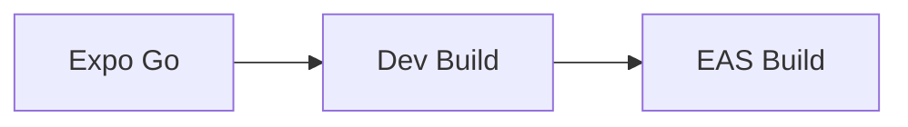

# 14 Build

## ゴール

- Expo Go と dev build の違いを理解する
- prebuild の役割を説明できる
- EAS Build の位置付けを理解する

## 手順

前章で検証方針を決めたので、ビルドの違いを理解する。

用語定義:
- dev build: 開発用にカスタムされたネイティブビルド。
- prebuild: Expo プロジェクトからネイティブプロジェクトを生成する操作。
- EAS Build: Expo のクラウドビルド。

1. Expo Go と dev build を比較する

- Expo Go は共有ランタイム
- dev build は独自のネイティブ設定を含む

2. prebuild の役割を理解する

```bash
npx expo prebuild
```

3. `app.json` の build 設定を見る

```json
{
  "expo": {
    "name": "rn-handson",
    "version": "1.0.0"
  }
}
```

ビルドの流れ:



## 詰まりポイント

- Expo Go で動くものが dev build で動かない
- prebuild 後の差分管理が難しい

## Webとの差分

- ネイティブビルド工程が必要になる

## 振り返り

- どのタイミングで dev build が必要か説明できるか
- 次はリリース前チェックに進む
