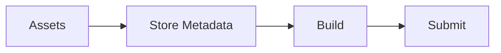

# 15 Release Checklist

## ゴール

- リリース前の確認項目を整理できる
- アイコン、スプラッシュ、バージョン管理を理解する

## 手順

前章のビルドを前提に、ストア提出前の準備を整理する。

用語定義:
- version: アプリの公開バージョン。
- buildNumber: ストア向けのビルド番号。

1. `app.json` のメタ情報を確認する

```json
{
  "expo": {
    "name": "rn-handson",
    "icon": "./assets/icon.png",
    "splash": {
      "image": "./assets/splash.png",
      "resizeMode": "contain"
    },
    "version": "1.0.0"
  }
}
```

2. ストア提出前のチェックを行う

- 権限説明文を準備する
- プライバシーポリシーを用意する
- 審査用アカウントを用意する

準備フロー:



## 詰まりポイント

- 端末によってスプラッシュが歪む
- バージョン更新を忘れる

## Webとの差分

- ストア審査とメタデータ登録が必要

## 振り返り

- リリース前のチェック項目を列挙できるか
- 次は振り返りに進む
