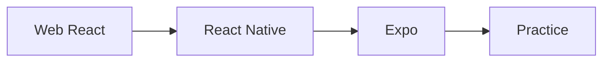

# 99 Retrospective

## ゴール

- Web React と RN の違いを整理できる
- Expo の思想を言語化できる
- 次にやることを決められる

## 手順

ここまでの学びを整理して、次の学習テーマを決める。

用語定義:
- DX: Developer Experience。開発者体験。

1. 振り返りテンプレートを使う

```md
## 学んだこと
- 

## 詰まったこと
- 

## 次にやること
- 
```

2. Web React との差分をまとめる

- UI 描画は DOM ではなくネイティブ UI
- ビルドと配布はストア前提

学びの関係図:



## 詰まりポイント

- 体験が多すぎて学びが散らかる
- Web と比較しすぎて RN の強みを見失う

## Webとの差分

- 端末特性と OS 権限を意識する必要がある

## 振り返り

- 次に深掘りするテーマを 1 つ決めたか
- お疲れさまでした
